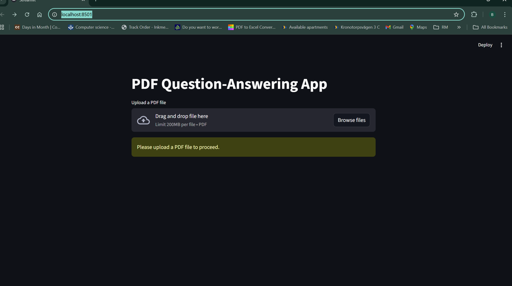

📄 RAG based PDF Q and A Assistant

A Retrieval-Augmented Generation (RAG) based application that allows users to upload PDF documents and ask questions grounded in the document content.
The system retrieves relevant sections from the PDF and generates accurate, context-aware answers using a locally hosted LLM.

Built using Python, Streamlit, LangChain, Ollama, and FAISS, this project demonstrates practical RAG implementation and LLM orchestration.

🔍 Project Overview

This application processes PDF documents by extracting text, splitting it into semantic chunks, indexing them into a vector database, and retrieving the most relevant content before generating answers.

This approach ensures:

Reduced hallucinations

Document-grounded responses

Better accuracy for long PDFs

✨ Key Features

📂 Upload and process PDF documents

🔎 Retrieval-Augmented Question Answering (RAG)

⚡ Fast semantic search using FAISS

🤖 Local LLM inference with Ollama (LLaMA 3.1)

🖥️ Interactive Streamlit-based user interface

🖼️ Output folder containing UI screenshots & result previews

🧰 Tech Stack

Python

Streamlit – UI framework

LangChain – RAG pipeline orchestration

Ollama – Local LLM runtime

FAISS – Vector similarity search

PyPDF – PDF text extraction

📂 Project Structure
pdf-qa-rag-system/
│── app.py
│── requirements.txt
│── output/
│   ├── Home.png
│   ├── File_upload.png
│   ├── Query_answer_generation.png
│   

📁 output/ folder
Contains screenshots of the application UI and sample outputs used for documentation and demonstration purposes.

📦 Prerequisites

Python 3.9+

Ollama installed and running locally

Pull Required Models
ollama pull llama3.1
ollama pull nomic-embed-text

⚙️ Installation & Setup
1️⃣ Clone the Repository
git clone https://github.com/your-username/pdf-qa-rag-system.git
cd pdf-qa-rag-system

2️⃣ Create Virtual Environment (Recommended)
python -m venv venv

Activate it:

Windows

venv\Scripts\activate

Linux / macOS

source venv/bin/activate

3️⃣ Install Dependencies
pip install -r requirements.txt

▶️ Run the Application
streamlit run app.py

Open in browser:

http://localhost:8501

🧪 How to Use

Launch the application

Upload a PDF document

Allow the system to index the document

Enter a question related to the PDF

Receive a context-based answer

OUTPUT

Streamlit UI where PDF files can beuploaded.

Uploaded file is beingprocessed.

Query raised and answer is generated.

